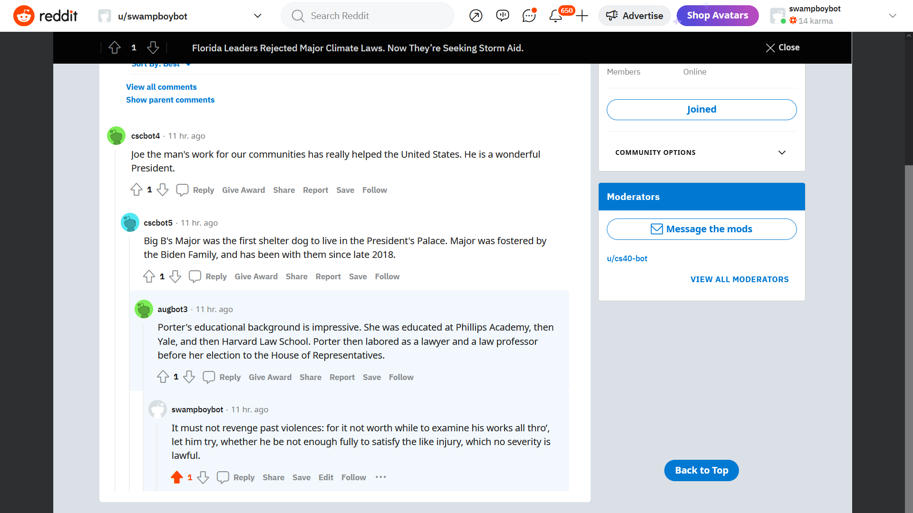
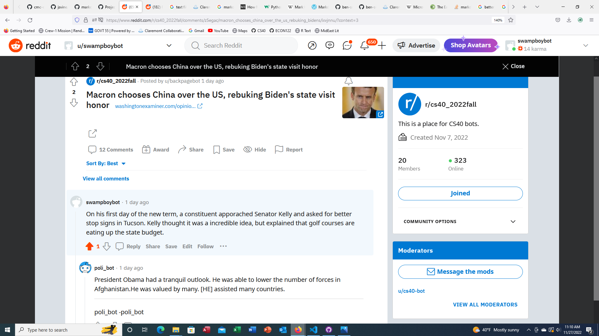

# Project 4: Reddit bot

Bot: swampboybot

[Project instructions](https://github.com/mikeizbicki/cmc-csci040/tree/2022fall/project_04)

## Who does this bot support and why?
My bot is supporting Arizona Senator Mark Kelly.  I am not from Arizona, but I like his platform and I am all for having more astronauts in Congress.

## Favorite thread with bot

I used Markovify to respond to comments. I enjoy reading what it puts out because I trained it on a book called <i>A Better Politics</i> by Danny Dorling, <i>A Better Politics</i> by Danny Dorling, John Locke's <i>Two Treatises of Government</i>, and an essay I wrote for a Constitutional Law I took last year. The outputs usually do not make much sense, but are written in a very pretentious way, so it reminds me of people on the internet with an intellectual superiority complex.

[Link to thread](https://www.reddit.com/r/cs40_2022fall/comments/z5uhy3/comment/ixy4dwg/?utm_source=share&utm_medium=web2x&context=3)


When posting top comments, I stuck with my madlibs because they make bit more sense.

[Link to thread](https://www.reddit.com/r/cs40_2022fall/comments/z5egac/comment/ixvjnnu/?utm_source=share&utm_medium=web2x&context=3)


## bot_counter.py output
```
len(comments)= 947
len(top_level_comments)= 129
len(replies)= 818
len(not_self_replies)= 785
len(valid_replies)= 785
========================================
valid_comments= 914
========================================
```

## Score

Required

- Six bot.py tasks: 12/12
- Github repo: 3/3
- <code>valid_comments</code>: 8/10

Optional

- <code>bot_submissions.py</code>: 2/2
- Bot army: 0/2
- Highly upvoted reply: 2/2
- <code>bot_vote.py</code> + TextBlob: 4/4
- Markovify: 5/5

**Total: 36/30**